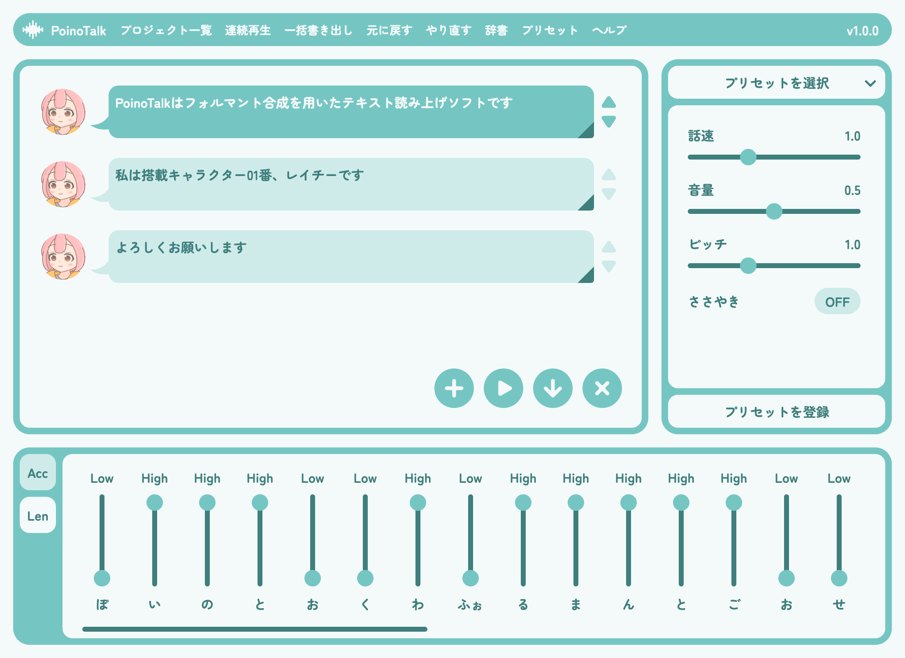

# PoinoTalk


フォルマント合成を用いた日本語テキスト読み上げソフト  

## ブラウザで使う
PoinoTalk 最新版  
https://koharuyuzuki.github.io/poinotalk/latest/  

PoinoTalk バージョン一覧  
https://koharuyuzuki.github.io/poinotalk/versions/  

## Q&A
Q&A.txt をご参照ください  

## ビルド
```
$ bun install
$ bun run build.ts
```

## ライセンス
PoinoTalk v1.1.0 及び PoinoTalk v1.1.0 で合成された音声は、PoinoTalk Licence 1.0 が適用されます  
詳細は LICENSE ファイルをご参照ください  
不明な点についてはライセンスQ&Aをご参照ください  

ライセンスQ&A  
https://github.com/KoharuYuzuki/PoinoTalkLicence?tab=readme-ov-file#qa  

### 注意事項
- screenshot.png は PoinoTalk Licence 1.0 の対象外です
- screenshot.png には Open Font License の Zen Maru Gothic フォントを使用しています

## サードパーティーライセンス
`build/*` には ThirdPartyNotices.txt に記載されたマテリアルが一部含まれています  
